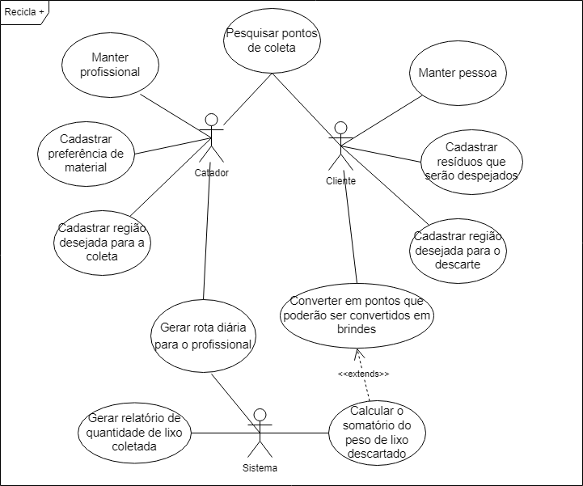
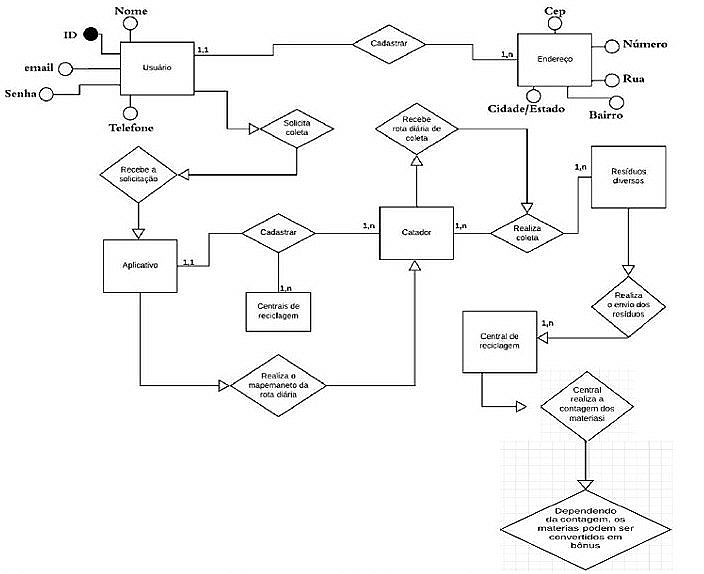

# Projeto-Reciclagem

<h1>Escopo do projeto </h1>

“Recicle +” é o nome do projeto que visa a adesão entre o coletor e o gerador de resíduos recicláveis, como papéis, vidros, papelão, metal, entre outros, através da criação de um software. Por meio deste, será possível reunir dados de locais para o descarte ou do recolhimento dos materiais separados para a reciclagem. Assim, foram definidas especificações para o desenvolvimento do projeto, tal como a Metodologia ágil Scrum com o auxílio da ferramenta Devops para a organização do projeto 

<h1>Missão do Produto</h1>

 Com o produto final do projeto, pretende-se criar uma plataforma que irá regularizar a situação dos catadores de materiais, os ajudando na coleta de forma mais segura e rentável, pois o software irá criar uma rota com os locais onde os lixos serão descartados para cada profissional, agilizando o seu serviço. Além disso, outro objetivo do projeto seria incentivar a população a separar os resíduos recicláveis em casa, tendo em vista que um responsável irá a um ponto ou em sua casa recolhê-los. Por fim, almeja-se contribuir com a preservação do meio ambiente e com a conscientização dos cidadãos. 

<h2>Diagrama de Caso de Uso</h2>
</img>
<h2>Diagrama de Entidade e Relacionamento</h2>
</img>